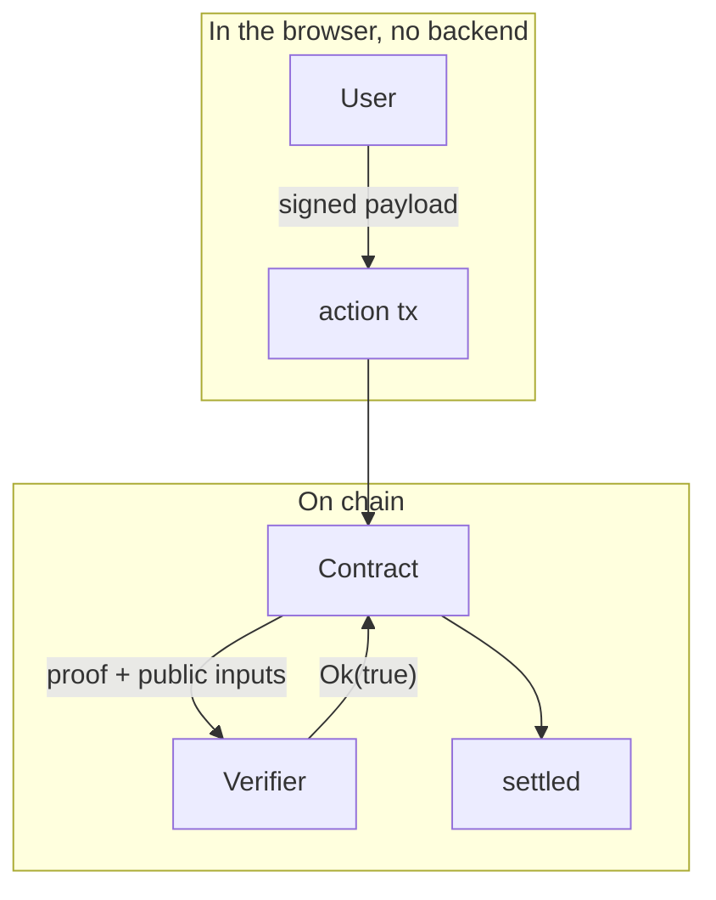

# readme-craft: evidence-first project READMEs

A README is the project's proof, not its ad. The reader it must convince
(a hackathon judge, a developer, a future maintainer) has seen a hundred
pages of adjectives today; the README that wins is the one where every claim
is a link, a number, a command, or a screenshot, and where a stranger can run
the project without asking anyone anything. This skill turns any repository
into that kind of README.

SKILL_GENERAL.md applies in full to every README this skill produces,
section 8 especially: no em dash, no en dash, no banned words, no empty
superlatives, English. Run its final-check greps on the README before
calling it done.

The method, in order. Do not skip or reorder; each step feeds the next.

1. Evidence pass: collect the facts, with sources, before writing any prose.
2. Register: pick the audience and the emoji policy.
3. Header block: title, icon, value proposition, badges, hero image.
4. Screenshots and images.
5. The architecture diagram.
6. Section playbook: write the body in the canonical order.
7. Writing rules and the final gate.

## Step 1: the evidence pass (no prose before this is done)

Never write a README from memory of what the project "probably" does. Read
the repository first and produce a fact sheet. Every entry carries the file
it came from; a claim with no source does not enter the README.

Collect:

| Fact | Where to read it |
| --- | --- |
| What the project actually does | entry points and main flows, in the code |
| The sharpest fact | the one sentence a rival project cannot say |
| Audience | judges, developers, users; decides the register |
| Exact tool versions | lockfiles, `engines`, `rust-toolchain`, `.tool-versions` |
| Run, build, test commands | `package.json` scripts, Makefile, `scripts/` |
| Deployed artifacts | addresses, URLs, tx hashes, from config files |
| The palette | 3 to 5 hex values from the app's CSS variables or tokens |
| Existing brand assets | logo, favicon, app icon in `public/`, `assets/` |
| Existing screenshots | `docs/screenshots/` or equivalent |
| Mocks, stubs, trust assumptions | the code, TODO comments, design docs |

Two rules with no exceptions:

- Every command that will appear in the README is executed in this session,
  or verified line by line against the script or manifest it calls. A
  command that was never checked is a claim you invented.
- Every deployed address, URL, and tx hash is read from a config or source
  file and, when a network is reachable, opened once to confirm it points at
  the right thing.

The sharpest fact deserves real thought. It is the mechanism that makes the
project different, stated as a fact. Model: "a zero-knowledge proof, not a
trusted server, decides who won and what they pay." Not a quality claim, a
mechanism claim. Find yours before writing anything else.

## Step 2: pick the register

The register decides tone, emoji policy, and which sections are mandatory.

| Register | Emoji in titles | Hero image | Honesty section |
| --- | --- | --- | --- |
| Hackathon or web submission | yes, one per H2; H1 allowed | mandatory | mandatory |
| Product or web app | optional | mandatory | recommended |
| Library, SDK, or CLI | no | optional (terminal capture) | recommended |
| Research or infrastructure | no | diagram instead | mandatory |

### Emoji policy (when the register allows them)

Emojis earn their place only as a scanning aid: they let a judge who has 90
seconds find "how it works" and "getting started" without reading. Used
inconsistently they read as neglect, so:

- One emoji per heading at most, always leading: `## 🧭 How it works`.
- All H2 headings or none. Decide once, apply everywhere.
- Semantic, not decorative. Pick from one consistent set, for example:
  🎯 problem, 🔐 privacy or security, 🧭 how it works, 🏗 architecture,
  ⚡ performance, 🚀 getting started or deploy, 🧪 tests or reproduce,
  📦 packages or layout, 🔗 live instances or links, ⚠️ limitations or
  mocks, 🏆 hackathon context, 📜 license.
- Never inside prose, tables, badges, or code blocks.
- In the H1 only for the hackathon register, and skip it when an icon image
  already opens the page: icon plus emoji is double decoration.

## Step 3: the header block

The first screen decides whether the reader scrolls. Fixed order:

1. Icon (when one exists or can honestly be made)
2. Title
3. Value proposition, 2 to 3 sentences
4. Context line ("Built for ...")
5. Badges
6. Hero image

### Icon

Source priority:

1. An existing brand asset in the repo: check `public/favicon.svg`,
   `public/`, `assets/`, the app's logo component.
2. If none exists and the register is a submission, create a simple SVG
   mark: flat, 1 or 2 colors taken from the project palette, a shape tied
   to the domain, readable at 32 px. A mark, not a wordmark.
3. Otherwise skip the icon. A plain H1 beats a generic decoration.

Store the file at `docs/assets/` (create the folder). Never hotlink an
external image; it will die. Header pattern with an icon:

```html
<p align="center">
  
</p>
<h1 align="center">ProjectName</h1>
<p align="center">One sentence that states the sharpest fact.</p>
```

Without an icon, use a plain markdown `# Title` and normal paragraphs.

### Value proposition

Formula: what it is, for what domain, and the sharpest fact from step 1.
Under 60 words, zero adjectives a benchmark could not defend. The model:

> Sealed-bid Vickrey auctions for tokenized real-world assets on Stellar,
> where a zero-knowledge proof, not a trusted server, decides who won and
> what they pay. No bid amount is ever revealed on chain, the winner's
> included.

Then one context line: "Built for the [event name] hackathon." or the
project's purpose. This line does real work for judges: it says "score me".

## Step 4: badges

Badges are compressed facts, not decoration. 4 to 6, one fact each:
platform or network, core stack, the load-bearing technology, where it
runs, license. Optionally CI status when the repo is public.

Anatomy of a static shields.io badge:

```

```

Encoding rules that break badges when forgotten: space becomes `%20`, a
literal hyphen inside label or message doubles to `--`, a literal
underscore doubles to `__`. The hex color has no `#`.

Colors come from the project's own palette collected in step 1 (CSS
variables, tailwind config, design tokens), never from shields defaults and
never recycled from another project's README. This is what makes the header
look designed instead of assembled. Reference block:

```markdown


```

Live CI badge when a workflow exists:

```
https://img.shields.io/github/actions/workflow/status/<owner>/<repo>/<file>.yml
```

Never a badge whose message is an adjective. "coverage 94%" is a badge;
"quality: high" is not.

## Step 5: screenshots and images

For a web submission, screenshots are mandatory: they are the only proof
the product exists that a judge can check in five seconds. For anything
with a UI they are close to mandatory. For a CLI, capture a real terminal
session instead. For pure infrastructure, the diagram carries the weight.

Storage and referencing:

- `docs/screenshots/`, numbered in reading order: `01-auctions.png`,
  `02-auction-open.png`. Marks and icons go in `docs/assets/`.
- Relative paths only, so GitHub renders them. Alt text always.

The hero image sits right after the badges: one screenshot of the product
doing its one job, with real data on screen. Stage the data first; an empty
state or seeded junk says "nobody uses this". If the repo has a staging or
demo script (or a playwright screenshot setup), run it; if not, drive the
app by hand until the screen tells the story, then capture.

Capture rules: the app's default theme, viewport 1280 to 1600 px wide, no
browser chrome, no devtools, PNG, each file under 500 KB after compression.
Judges open READMEs on hotel wifi.

Additional states go in a two-column table whose headers are the captions:

```markdown
| Bidding (sealed) | Settled (verified on chain) |
| --- | --- |
|  |  |
```

Sizing and themes:

- When an image must not dominate, control it with
  ``.
- GitHub renders in light and dark. Avoid transparent PNGs of light-theme
  UI; give screenshots an opaque background. A mark that needs both themes
  can use `<picture>` with a `prefers-color-scheme: dark` source.
- One short GIF or MP4 under 10 MB only when motion is the product;
  otherwise stills. Three well-chosen screenshots beat one blurry video.

Never fake an asset. No mockups presented as screenshots, no placeholder
images, no borrowed visuals. A section whose asset cannot be produced
honestly is omitted, with a note to the human on how to capture it later.

## Step 6: the architecture diagram

One mermaid diagram is mandatory for any system with two or more runtimes,
services, or trust domains, because prose cannot show a boundary. GitHub
renders mermaid natively.

Default shape: `flowchart TD` with one subgraph per boundary (browser vs
chain, client vs server, plugin vs host) and labeled edges carrying what
actually crosses (the payload, the tx, the event). Skeleton:



Rules learned the hard way:

- Quote every label that contains spaces, parentheses, or punctuation;
  unquoted labels are the top cause of render failures.
- Keep it under about 20 nodes. Past that, split into two diagrams.
- Keep the default theme. Hardcoded colors break one of GitHub's two
  themes.
- Use `sequenceDiagram` when the order of messages is the point (protocols,
  handshakes); `flowchart` when the topology is.
- Verify the render before done, on GitHub preview or mermaid.live. A
  broken diagram block is worse than no diagram.

Follow the diagram with a short prose paragraph covering what the picture
cannot show: failure paths, refunds, retries, grace periods. The diagram
shows the happy path; the prose proves you handled the others.

## Step 7: the section playbook

Canonical order. "Always" means every README; conditional sections are
included when their condition holds and omitted entirely otherwise, never
left as stubs.

| # | Section | When | Job |
| --- | --- | --- | --- |
| 1 | Header block | always | identity and proof of life |
| 2 | The problem | submissions, products | the pain and the trust gap |
| 3 | What it does | always | 3 to 6 capability bullets |
| 4 | How it works | any system | diagram plus failure prose |
| 5 | Deep dive | one artifact deserves a table | prove the rigor |
| 6 | Live instances and evidence | anything is deployed | verifiable links |
| 7 | Reproduce it | always | versions, commands, success criterion |
| 8 | What is real and what is mocked | submissions, demos | honesty |
| 9 | Prior art and related work | neighbors exist | differentiation |
| 10 | Repository layout | always | the tree, one line per folder |
| 11 | License | a LICENSE file exists | SPDX name plus links |

Per-section rules:

- **The problem.** Concrete pain first ("competitors read your size,
  front-run your fill, and price you against yourself"), then the usual
  flawed fix, then the trust gap the project closes. Two paragraphs, no
  solution talk yet.
- **What it does.** Each bullet is a bold lead-in plus one concrete
  mechanism: "**Sealed bids.** A bidder commits to `(price, salt)` with a
  Poseidon hash...". No bullet without a noun a developer can grep for.
- **Deep dive.** The one table that proves the project is engineered, not
  improvised: public signals of a circuit, the API surface, the schema, the
  state machine. One table, chosen well, beats five shallow ones.
- **Live instances and evidence.** A table of deployed artifacts with
  explorer or dashboard links. Then the evidence list: links that prove the
  core claim. The strongest move available is a negative proof next to the
  positive one: "flip one byte of the public price and the same verifier
  returns false: tx ...". One honest negative test buys more trust than ten
  green claims, because it shows the system can say no.
- **Reproduce it.** Prerequisites with the exact versions from step 1,
  then the copy-paste block a stranger runs from zero, then what success
  looks like, stated: "exits 0 only if every assertion passes". Also state
  what the script will and will not touch ("deploys fresh contracts on each
  run and never touches the standing instances").
- **What is real and what is mocked.** Format each item as: "**The X is
  mocked (or trusted).** What stands in, why it holds for the demo, and the
  production path." List every mock, every trust assumption, every known
  liveness or security limitation. Judges and users trust the README that
  states its own weaknesses; a hidden one that gets found costs everything.
- **Prior art.** Name the neighbors, one sentence of honest difference
  each, with links. "Complementary primitive" beats pretending to be alone
  in the field.
- **Repository layout.** The real tree, top-level folders only, one line
  each, in a plain code block.

## Step 8: writing rules

- Verifiable or absent: every claim carries a link, a number, a file path,
  or a command. A sentence that cannot carry one gets deleted.
- Numbers over adjectives: "13 public signals", "depth 10, up to 1024
  members", never "highly scalable".
- Expand jargon at first use: "Vickrey second price: the highest bid wins
  but pays the second-highest price."
- Bold lead-ins for bullets, tables for enumerable facts, prose for
  causality and failure paths.
- Link text names its target ("tx 2085aa97", "docs/MOCKS.md", "view"),
  never "click here".
- Wrap prose near 80 columns so diffs stay reviewable.
- SKILL_GENERAL.md section 8 governs every word choice. Run its greps.

## Step 9: the final gate

All boxes checked before the README is called done. On any failure, fix and
re-run the gate.

```
[ ] Every image path exists in the repo, exact case-sensitive match
[ ] Every command block was executed or verified against its script, and
    the success criterion is stated next to it
[ ] Every external link opens the right entity (tx, contract, doc, URL)
[ ] The mermaid block renders (GitHub preview or mermaid.live)
[ ] Badges render: %20, --, __ encoding checked, colors from the palette
[ ] Emoji policy consistent: all H2s or none, one per title, leading
[ ] Honesty section present for any submission or demo register
[ ] SKILL_GENERAL.md final-check greps pass on the README file
[ ] Value proposition states the sharpest fact in under 60 words
[ ] A stranger with only this README can run the project
[ ] Screenshots show the current UI with real data, each under 500 KB
[ ] No fabricated asset anywhere; missing assets are omitted, not faked
```

## Template skeleton

Fill from the fact sheet; delete conditional blocks that do not apply.

````markdown
<!-- icon block: only when an icon exists (step 3) -->
<p align="center"></p>

# {Name}   <!-- hackathon register may use: # {emoji} {Name} -->

{What it is} for {domain}, where {the sharpest fact}. {One more sentence of
mechanism, zero adjectives.}

Built for {event or purpose}.


<!-- 4 to 6 badges, one fact each -->


| {State A} | {State B} |
| --- | --- |
|  |  |

## The problem

{Concrete pain.} {The usual flawed fix.} {The trust gap.}

## What it does

- **{Capability}.** {Mechanism with greppable nouns.}

## How it works

```mermaid
flowchart TD
    subgraph {boundary_a}["{Boundary A}"]
        {nodes and labeled edges}
    end
    subgraph {boundary_b}["{Boundary B}"]
        {nodes and labeled edges}
    end
```

{Failure-path prose: what happens when it does not go well.}

### {The one deep-dive table}

| {Key} | {Field} | {Meaning} |
| --- | --- | --- |

## Live on {network or platform}

| {Artifact} | {Id or URL} | {Link} |
| --- | --- | --- |

Evidence:

- {Positive proof: the live thing working, linked.}
- {Negative proof: the system rejecting a wrong input, linked.}

## Reproduce it

Prerequisites: {exact versions from lockfiles}.

```bash
{the copy-paste block a stranger runs from zero}
```

{What success looks like, stated.}

## What is real and what is mocked

- **{The X is mocked.}** {What stands in, why it holds, production path.}

## Prior art and related work

- **{Neighbor}**: {one sentence of honest difference}. [{link}]({url})

## Repository layout

```
{folder}/   {one line}
```

## License

{SPDX id}. See [LICENSE](LICENSE).
````
