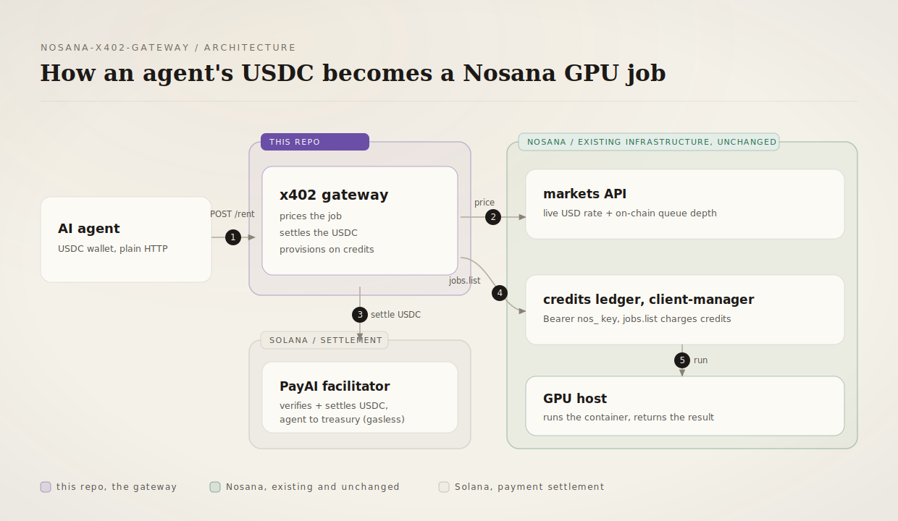
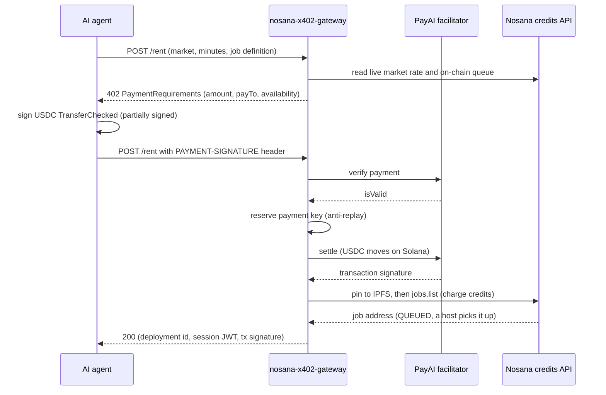

<p align="center">
  
</p>

<h1 align="center">nosana-x402-gateway</h1>

<p align="center">
  An HTTP 402 gateway that lets any AI agent rent Nosana GPU compute by paying
  USDC on Solana: no Nosana account, no NOS token, no Solana SDK on the agent
  side. It prices each job from Nosana's live market rate, settles the USDC on
  chain, then provisions the GPU on Nosana credits.
</p>

<p align="center">A working proposal for native x402 support in Nosana, proven on mainnet.</p>

<p align="center">
  
  
  
  
  
  
</p>

<p align="center">
  
</p>

The violet block is the only new piece: this repo. Everything in green already
exists in Nosana and is untouched. The gateway reads Nosana's live markets,
settles the agent's USDC on Solana through the PayAI facilitator, and posts the
job on Nosana's credits API (`jobs.list`, `Bearer nos_` key). Nosana's other
rail, the permissionless on-chain jobs program, wants NOS and a signing wallet;
the credits rail is USD-denominated and takes an API key, which is why the
gateway targets it. Settling those USDC payments straight into Nosana's own
credit ledger, so no operator sits in the middle, is the endgame and the reason
this is a proposal.

The whole loop, run end to end against Nosana mainnet with the mock agent in
[scripts/agent-demo.ts](scripts/agent-demo.ts):

```console
$ bun run scripts/agent-demo.ts        # AGENT_X402_NETWORK=solana, market nvidia-3060
PASS    discover markets       46 markets, using "nvidia-3060"
PASS    rent (pay 402)         deployment=9H4bVD1v... paid=0.003634 USD tx=3dkKwc4B...
PASS    poll until running     RUNNING
BLOCKED hit deployment endpoint credits-rail job exposes no service URL
PASS    extend (pay 402)       new timeout=10 minutes tx=3hGVh8sc...
PASS    stop                   final status=COMPLETED
```

An agent holding only USDC and speaking plain HTTP paid for a GPU, ran a job,
paid again to extend it, and stopped it. Links under [Live on Solana mainnet](#live-on-solana-mainnet).

## The problem

An AI agent that needs a GPU today has two doors into Nosana, and both need a
human. The on-chain door wants NOS, SOL, and the Solana SDK. The hosted door
wants someone to register, buy credits with a card, and hand over an API key.
Either way a person provisions identity and funding before the first job runs.

Agent treasuries hold USDC and speak plain HTTP. The x402 protocol closes that
gap: the server quotes a price inside an HTTP 402, the client pays on chain, and
the request retries with proof of payment. Nosana has no x402 surface today;
this gateway is that surface, on Nosana's public SDK, with zero changes to their
stack.

## What it does

- **One paid endpoint.** `POST /rent` speaks x402 v2: with no `PAYMENT-SIGNATURE`
  header it answers 402 with `PaymentRequirements` and a `PAYMENT-REQUIRED`
  header; with one it verifies, settles, provisions, and returns the job. See
  [src/routes/rent.ts](src/routes/rent.ts).
- **Server-side pricing.** The quote is `usd_reward_per_hour` from the live
  markets API, prorated per minute in integer micro-USD (BigInt ceiling
  division, no floating point on money). Client-supplied prices do not exist.
  See [src/lib/pricing.ts](src/lib/pricing.ts).
- **Availability before payment.** The 402 and `GET /markets` carry a live
  `availability` block read from each market's on-chain queue, so an agent knows
  whether a host is idle now or it will wait before it pays. An opt-in
  `require_available` flag refuses to charge for a queued market. See
  [src/lib/availability.ts](src/lib/availability.ts).
- **Settle before provision.** The facilitator settles the USDC before the job
  is posted, because a GPU handout is irreversible and verify alone does not
  prove finality. See [src/lib/paymentFlow.ts](src/lib/paymentFlow.ts).
- **Credits-rail provisioning.** The job is pinned to IPFS, then posted with
  `jobs.list` on the credits API; the operator's credits pay the host. See
  [src/lib/provisioning.ts](src/lib/provisioning.ts).
- **Replay protection.** A SQLite ledger keyed by the SHA-256 of the payment
  header, with a UNIQUE constraint on the settled transaction signature; the
  reservation insert is the atomic check-and-set. See
  [src/lib/settlementStore.ts](src/lib/settlementStore.ts).
- **Refund ledger.** A payment that settles but fails to provision is recorded
  `provision_failed`; the startup scan reprints every refund owed with its tx.
- **Scoped sessions.** Each rental returns an HS256 JWT bound to one
  `deployment_id`; lifecycle routes reject a session shown against another job.
  See [src/lib/session.ts](src/lib/session.ts).

## How it works

The diagram above is the topology; this is the exact x402 handshake.



The unhappy paths are where the design lives. A garbage or invalid payment is
refused at verify, before any settle, with 402 and no money moved:

```console
$ curl -s -w "\nHTTP %{http_code}\n" -X POST localhost:3000/rent \
    -H "PAYMENT-SIGNATURE: bm90LWEtcmVhbC1wYXltZW50" \
    -H "content-type: application/json" \
    -d '{"market":"nvidia-3060","duration_minutes":60,"job_definition":{...}}'
{"error":"payment verification failed: unexpected_verify_error"}
HTTP 402
```

A settle that succeeds but a provision that fails marks the payment
`provision_failed` and hands the tx back to the agent for refund. A facilitator
transport failure returns 502, distinct from a payment rejection (402). A
replayed header, or a second header carrying an already-settled tx, stops at 409
before any fulfillment. A gateway with no API key refuses every payment with 503
before verify, so money never moves toward capacity that is not there.

### API surface

| Route | Auth | Success | Distinct failures |
| --- | --- | --- | --- |
| `POST /rent` | x402 payment | 200 deployment, session, tx | 400 input, 402 payment, 404 market, 409 replay, 502 upstream, 503 capacity |
| `GET /rent/:id` | session JWT | 200 status, timeout | 401 session, 502 lookup |
| `POST /rent/:id/extend` | session JWT + x402 | 200 new timeout, session | as `POST /rent` plus 401 |
| `POST /rent/:id/stop` | session JWT | 200 stopped | 401 session, 502 upstream |
| `GET /markets` | none | 200 tiers with live rates and availability | 502 upstream |
| `GET /health` | none | 200 | none |

## Live on Solana mainnet

The full rent, run, extend, stop loop, executed end to end on 2026-07-06:

| Step | Result | Proof |
| --- | --- | --- |
| Rent, pay 402 | 0.003634 USDC settled | tx [3dkKwc4B](https://solscan.io/tx/3dkKwc4BtirCXgoerhpHeLejTg7SHQQPCCXpHhzF6qkjkndia3MDhezPkckqG5RHjspQWfeSascUywSfXCHj7K1s) |
| Provision on credits | job posted, reached RUNNING | job [9H4bVD1v](https://solscan.io/account/9H4bVD1vNRzAj2J7EVPajEcopMV46b4WUHyVR1YpV2Pj) |
| Extend, 2nd payment | timeout 5 to 10 minutes | tx [3hGVh8sc](https://solscan.io/tx/3hGVh8scMP5JXdKqrhXXhWTrQRUKJqupkPMszRZxyBGRHn2xnkVweV5o8TtCAiRxgdu6RQAbRYZ1nQmXdGnY46Jk) |
| Stop | final status COMPLETED | run log above |

`GET /markets` on mainnet returns 47 tiers, each with the queue read from chain.
At capture time `nvidia-5070` had 25 idle hosts (a paid job starts at once) and
`nvidia-4070` had 297 jobs queued (a paid job waits): exactly the difference the
`availability` block tells the agent before it pays.

The strongest evidence is a negative one. Payment
[66rz5eLo](https://solscan.io/tx/66rz5eLoQb1viiX1t8LHKcRyRGqZYb6nfyMuAvi3U92L6AfNRskYMcLS7M35XRxEhBUMtmmk5p6soxALpGt7Ehg6)
settled on chain but its provision failed; the gateway did not pretend it
succeeded. It returned 502 with the signature and recorded a refund owed. A
system that can say "you paid and I could not deliver" is one you can trust with
the happy path.

## Reproduce it

Prerequisites: [Bun](https://bun.sh) 1.3 or later (built and tested on 1.3.14).
No Nosana account is needed for quote-only mode.

```bash
git clone https://github.com/Andy00L/nosana-x402-gateway
cd nosana-x402-gateway
bun install
cp .env.example .env
# Set TREASURY_WALLET_ADDRESS to a base58 pubkey you control, JWT_SECRET to
# `openssl rand -hex 32`, and NOSANA_X402_NETWORK=mainnet to browse real markets
# (quote-only: no funds move without a payment).
bun run dev
```

Then, in another terminal:

```bash
curl -s localhost:3000/markets
curl -s -w "\nHTTP %{http_code}\n" -X POST localhost:3000/rent \
  -H "content-type: application/json" \
  -d '{"market":"nvidia-3060","duration_minutes":60,"job_definition":{"version":"0.1","type":"container","ops":[{"type":"container/run","id":"demo","args":{"image":"nginx"}}]}}'
```

The first call returns the live market list with an `availability` field per
tier; the second returns `HTTP 402` with a body starting `{"x402Version":2` and
an `amount` matching the market rate. `bun run typecheck` exits 0 on a clean
clone, and `bun test` runs 89 unit tests. Every command here was run against this
revision.

## What is real and what is not

- **The money-moving loop is signed off on mainnet.** Rent, run, extend, and
  stop all ran with real USDC and credits (transactions above). The rest below
  is stated plainly.
- **The credits rail exposes no live service URL.** A compute job returns
  results by job id through IPFS; a service job that exposes a port (the nginx
  demo) gets no reachable URL the way the deployment manager did, so the demo
  marks that step blocked. Surfacing service URLs on the credits rail is an open
  question for the Nosana team.
- **Refunds are recorded, not sent.** The ledger and startup scan name every
  refund owed with its tx; automated refunds need the treasury hot wallet and a
  security review. One refund of 0.000727 USDC is outstanding.
- **The renter fee question is open.** Markets expose `network_fee_percentage`
  (10 today); whether the renter pays it on top of `usd_reward_per_hour` is
  unconfirmed, so the gateway charges the base rate. Asked to the Nosana team.
- **Quote-only mode oversells.** Without `NOSANA_API_KEY` the gateway quotes
  what it cannot fulfill, for local dev; every payment is refused with 503 first.
- **No rate limiting yet.** The paid path is metered by payment, but the quote
  path can be spammed into the markets API (60s cache aside).
- **The trust model is custodial for v1.** The operator's wallet receives the
  USDC and the operator's credits pay for compute. Settling x402 straight into
  Nosana's credit ledger is the upstream goal and needs their backend.

## Repository layout

```
src/
  index.ts       entry point: config, wiring, on-chain availability adapter, refund scan
  config.ts      environment validation, crash early on bad config
  lib/           pricing, markets, availability, x402 wrappers, payment gauntlet,
                 settlement store, sessions, credits provisioning, timeouts
  routes/        rent (quote, pay, lifecycle), markets discovery, admin ledger
  *.test.ts      unit tests colocated with the modules they cover
scripts/         agent-demo.ts, the mock x402 agent for the mainnet sign-off
docs/assets/     the icon and the architecture diagram
.env.example     every environment variable, documented
```

## License

MIT. See [LICENSE](LICENSE).
