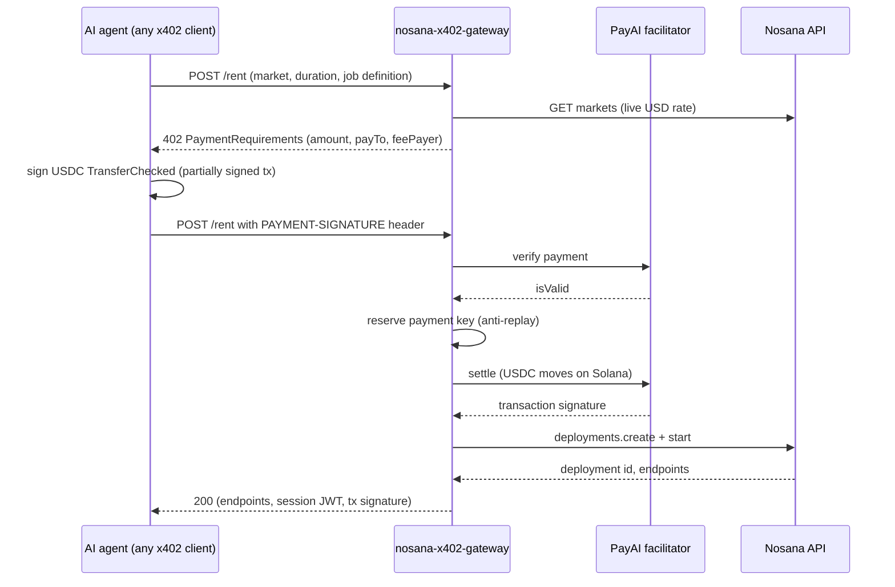

# nosana-x402-gateway

An x402 payment gateway for Nosana GPU compute. An AI agent POSTs a job to
`/rent`, receives an HTTP 402 quote priced live from Nosana's markets, pays
USDC on Solana, and gets back a running GPU deployment with a scoped session
token. The payment is the account: no registration, no NOS token, no Solana
SDK on the agent side.

Built as a working proposal for native x402 support in Nosana.


The gateway answering a rent request, captured live against Nosana's mainnet
market prices (quote-only mode, one hour of `nvidia-3090`):

```console
$ curl -s -X POST localhost:3402/rent -H "content-type: application/json" \
    -d '{"market":"nvidia-3090","duration_minutes":60,"job_definition":{...}}'
HTTP 402
{"x402Version":2,
 "resource":{"url":"http://localhost:3402/rent",
   "description":"Nosana GPU rental: NVIDIA 3090 for 60 minutes"},
 "accepts":[{"scheme":"exact",
   "network":"solana:5eykt4UsFv8P8NJdTREpY1vzqKqZKvdp",
   "amount":"174500",
   "payTo":"7BF8eaGq9hgJGQcauqZyDwkfF9ZViHomwvnLnjw7ABLw",
   "maxTimeoutSeconds":300,
   "asset":"EPjFWdd5AufqSSqeM2qN1xzybapC8G4wEGGkZwyTDt1v",
   "extra":{"feePayer":"2wKupLR9q6wXYppw8Gr2NvWxKBUqm4PPJKkQfoxHDBg4"}}],
 "error":"Payment required"}
```

`amount` is `174500` atomic USDC units, 0.1745 USD: the live 0.1745 USD/hour
rate of the `nvidia-3090` market at capture time, computed server-side.

## The problem

An AI agent that needs a GPU today has two doors into Nosana, and both need a
human. The on-chain door requires the agent to hold NOS plus SOL and to speak
the Solana SDK. The hosted door requires a person to register an account, buy
credits with a card, and hand the agent an API key. Either way, someone
provisions identity and funding before the first job runs.

Meanwhile agent treasuries hold USDC and speak plain HTTP. The x402 protocol
closes exactly that gap: a server quotes a price inside an HTTP 402 response,
the client pays on chain, and the same request retries with proof of payment.
Nosana has no x402 surface today; this gateway is that surface, built on
Nosana's public SDK with zero changes to their stack.

## What it does

- **One paid endpoint.** `POST /rent` speaks x402 v2: without a
  `PAYMENT-SIGNATURE` header it answers 402 with `PaymentRequirements`; with
  one it verifies, settles, provisions, and returns the deployment.
- **Server-side pricing.** The quote is `usd_reward_per_hour` from Nosana's
  live markets API, prorated per minute in integer micro-USD (BigInt ceiling
  division, one rounding step, no floating point on money). Client-supplied
  prices do not exist. See [src/lib/pricing.ts](src/lib/pricing.ts).
- **Settle before provision.** The facilitator settles the USDC transfer
  before `deployments.create` runs, because a GPU handout is irreversible and
  verify alone does not prove on-chain finality. See
  [src/lib/paymentFlow.ts](src/lib/paymentFlow.ts).
- **Replay protection.** A SQLite ledger keyed by the SHA-256 of the payment
  header, with a UNIQUE constraint on the settled transaction signature; the
  reservation insert is the atomic check-and-set. See
  [src/lib/settlementStore.ts](src/lib/settlementStore.ts).
- **Refund ledger.** A payment that settles but fails to provision is
  recorded as `provision_failed`; the startup scan prints every refund owed
  with its transaction signature.
- **Scoped sessions.** Each rental returns an HS256 JWT bound to one
  `deployment_id`. Lifecycle routes reject a session presented against any
  other deployment. See [src/lib/session.ts](src/lib/session.ts).
- **Agent-friendly discovery.** `GET /markets` lists GPU tiers by slug
  (`nvidia-3090`, `nvidia-3060`) with live USD rates, so an agent never
  touches a Solana address it did not have to.

## How it works



The unhappy paths are where the design lives. A failed settle releases the
reservation, so the agent can retry the same signed transaction after a
transient facilitator failure. A settle that succeeds but a provision that
fails marks the payment `provision_failed` and returns the transaction
signature to the agent; the startup scan lists every such record as a refund
owed. A replayed payment header, or a second header carrying an
already-settled transaction, stops at 409 before any fulfillment. A gateway
with no Nosana API key refuses every payment with 503 before verification, so
money never moves toward capacity that does not exist. Facilitator transport
failures return 502, distinct from payment rejections, which return 402.

Rejection is tested live. A garbage `PAYMENT-SIGNATURE` submitted to a
configured gateway comes back refused by the PayAI facilitator:

```console
$ curl -s -w "\nHTTP %{http_code}\n" -X POST localhost:3403/rent \
    -H "PAYMENT-SIGNATURE: bm90LWEtcmVhbC1wYXltZW50" \
    -H "content-type: application/json" -d '{"market":"scenario-test-dm",...}'
{"error":"payment verification failed: unexpected_verify_error"}
HTTP 402
```

### API surface

| Route | Auth | Success | Distinct failures |
| --- | --- | --- | --- |
| `POST /rent` | x402 payment | 200 deployment, endpoints, session, tx | 400 bad input, 402 payment, 404 unknown market, 409 replay, 502 upstream, 503 capacity |
| `GET /rent/:id` | session JWT | 200 status, endpoints, timeout | 401 session, 502 lookup |
| `POST /rent/:id/extend` | session JWT + x402 payment | 200 new timeout, refreshed session | same as `POST /rent` plus 401 |
| `POST /rent/:id/stop` | session JWT | 200 stopped | 401 session, 502 upstream |
| `GET /markets` | none | 200 tiers with live USD rates | 502 upstream |
| `GET /health` | none | 200 | none |

## Reproduce it

Prerequisites: [Bun](https://bun.sh) 1.3 or later (built and tested on
1.3.14). No Nosana account is needed for quote-only mode.

```bash
git clone https://github.com/Andy00L/nosana-x402-gateway
cd nosana-x402-gateway
bun install
cp .env.example .env
# In .env set TREASURY_WALLET_ADDRESS to a base58 pubkey you control,
# JWT_SECRET to the output of: openssl rand -hex 32,
# and NOSANA_X402_NETWORK=mainnet to browse real markets (quote-only,
# no funds move without a payment).
bun run dev
```

Then, in another terminal:

```bash
curl -s localhost:3000/markets
curl -s -w "\nHTTP %{http_code}\n" -X POST localhost:3000/rent \
  -H "content-type: application/json" \
  -d '{"market":"nvidia-3060","duration_minutes":60,"job_definition":{"version":"0.1","type":"container","ops":[{"type":"container/run","id":"demo","args":{"image":"nginx"}}]}}'
```

Success looks like: the first call returns the live market list, the second
returns `HTTP 402` with a body starting `{"x402Version":2` and an `amount`
matching the market's hourly rate. `bun run typecheck` exits 0 on a clean
clone. Every command above was executed against this revision.

## What is real and what is not

- **The full money-moving loop is not signed off yet.** Everything up to and
  including the facilitator rejecting invalid payments is exercised live (the
  captures above are real). The final proof, real devnet USDC settling and a
  real deployment starting, is blocked on devnet credentials: Nosana's
  credits API only accepts API-key auth, dashboard keys do not authorize on
  the devnet client-manager, and no public devnet dashboard exists. Requested
  from the Nosana team.
- **Refunds are recorded, not sent.** The ledger and the startup scan name
  every refund owed with its transaction signature; automated refunds are
  gated behind a security audit before any mainnet use.
- **The renter fee question is open.** Markets expose a
  `network_fee_percentage` (10 today). Whether the renter pays it on top of
  `usd_reward_per_hour` is unconfirmed; the gateway currently charges the
  base rate. Asked to the Nosana team; reconciliation depends on the answer.
- **Quote-only mode oversells.** Without `NOSANA_API_KEY` the gateway serves
  quotes it cannot fulfill, for local development; every payment against it
  is refused with 503 before money moves.
- **No rate limiting yet.** The paid path is naturally metered by payment,
  but the quote path can be spammed into Nosana's markets API (60s cache
  notwithstanding).
- **The trust model is custodial for v1.** The operator's wallet receives the
  USDC and the operator's Nosana credits pay for the compute. Settling x402
  payments straight into Nosana's credit ledger is the upstream goal and
  needs their backend.

## Prior art and related work

- **[@nosana/kit](https://github.com/nosana-ci/nosana-kit)**: Nosana's own
  SDK already lets an agent rent on chain by holding NOS and speaking Solana;
  this gateway adds the USDC-over-HTTP door and builds on the kit rather than
  replacing it.
- **[x402-solana](https://github.com/PayAINetwork/x402-solana)**: the payment
  library this gateway uses server-side; it handles the x402 v2 wire format
  and facilitator calls, not compute.
- **[The-Solana-Sentinel](https://github.com/iamaanahmad/The-Solana-Sentinel)**:
  the only public repo tagged both `nosana` and `x402` before this one; a
  token risk-analysis agent, not a GPU rental gateway.
- **[x402 specification](https://github.com/coinbase/x402)**: the protocol
  itself, v2.

## Repository layout

```
src/
  index.ts     entry point: config, wiring, startup refund scan
  config.ts    environment validation, crash early on bad config
  lib/         pricing, markets, x402 wrappers, payment gauntlet,
               settlement store, sessions, provisioning
  routes/      rent (quote, pay, lifecycle) and markets discovery
docs/          execution plan and reviewed handoff notes
.env.example   every environment variable, documented
```

## License

MIT. See [LICENSE](LICENSE).
